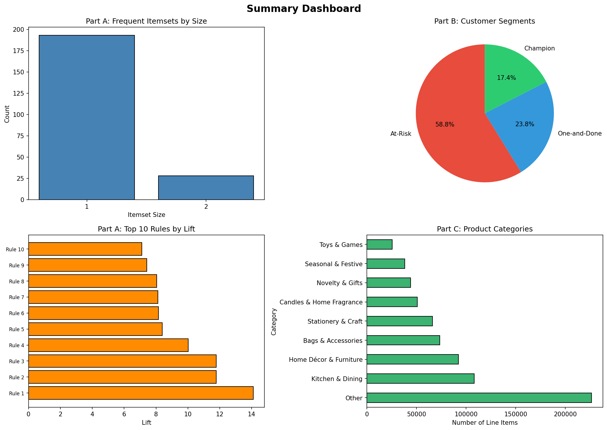

# Customer-Journey-Miner
Discovered that 58.8% of customers have gone silent. Built the pattern mining pipeline to find them, understand them, and win them back.
# 🛍️ From Clicks to Loyalty: Mining Customer Journey Patterns

> **Data Mining**  

---

## 📊 Summary Dashboard



---

## 📁 Repository Structure

```
├── notebook.ipynb              # Google Colab notebook (full pipeline)
├── summary_dashboard.png       # Summary visualisation dashboard
├── report.pdf                  # Full written report
└── README.md
```

---

## 🔍 Project Overview

This project builds a **full customer intelligence pipeline** on two years of real UK gift retail data using three core data mining techniques:

| Part | Technique | Goal |
|------|-----------|------|
| A | FP-Growth (Co-Purchase Mining) | Discover product bundles |
| B | Class Association Rules (CARs) | Segment & classify customers |
| C | Sequential Pattern Mining | Map the customer journey |

---

## 🧹 Preprocessing

- **Dataset:** UCI Online Retail II (Dec 2009 – Dec 2011)
- Removed cancelled invoices, missing Customer IDs, zero/negative quantities
- Filtered to **UK customers only**

| Metric | Value |
|--------|-------|
| Total Invoices | ~16,000+ |
| Unique Customers | ~3,950 |
| Unique Products | ~3,600 |
| Avg Basket Size | ~20 items |

---

## Part A — FP-Growth: Co-Purchase Mining

- Ran FP-Growth at **minsup = 2%**
- Found **192 single-item** and **27 pair** frequent itemsets
- No 3-itemsets at this threshold (wide catalogue, diverse baskets)

### 🏆 Top Association Rules by Lift

| Antecedent | Consequent | Lift |
|------------|------------|------|
| SWEETHEART CERAMIC TRINKET BOX | STRAWBERRY CERAMIC TRINKET BOX | **14.1×** |
| WOODEN FRAME ANTIQUE WHITE | WOODEN PICTURE FRAME WHITE FINISH | **11.8×** |
| LUNCH BAG WOODLAND | LUNCH BAG RED RETROSPOT | ~8× |
| JUMBO BAG STRAWBERRY | JUMBO BAG RED RETROSPOT | ~8× |

### 🎁 Recommended Product Bundles

- **Bundle 1 — Collector's Trinket Set:** Sweetheart + Strawberry Ceramic Trinket Box  
  *(72% confidence, lift 14.1× — highest in the dataset)*

- **Bundle 2 — Lunchbox Variety Pack:** Woodland + Pink Polkadot + Red Retrospot Lunch Bags  
  *(lift ~8×, confidence ~55%)*

---

## Part B — Class Association Rules: Customer Segmentation

### RFM Segmentation

Customers scored on **Recency**, **Frequency**, and **Monetary** value using 33rd/67th percentile splits.

| Segment | Count | Share | Profile |
|---------|-------|-------|---------|
| **At-Risk** | 3,145 | **58.8%** | Used to buy, have not returned lately |
| One-and-Done | 1,272 | 23.8% | Only 1–2 orders, very low spend |
| Champion | 933 | 17.4% | Recent, frequent, high spend |

> ⚠️ **Key Insight:** Over half the customer base has gone quiet — the At-Risk group is the primary target for re-engagement campaigns.

### CARs Mining (minsup = 1%, minconf = 55%)

- **Champions** buy across all categories in a single session
- **At-Risk / One-and-Done** show narrower, less varied baskets
- Strongest Champion CAR: multi-category basket (Candles + Kitchen + Bags + Home Décor) → repeat buyer

---

## Part C — Sequential Pattern Mining: The Customer Journey

### Product Category Scheme (8 categories + Other)

`Candles & Home Fragrance` · `Kitchen & Dining` · `Bags & Accessories` · `Home Décor & Furniture` · `Seasonal & Festive` · `Toys & Games` · `Stationery & Craft` · `Novelty & Gifts`

### Top Sequential Patterns (PrefixSpan, minsup = 0.5%)

| Pattern | Support |
|---------|---------|
| All-category basket → All-category basket | 8.74% |
| Narrow basket → Narrow basket | 6.86% |
| Broad basket (no Seasonal) → Full basket | 6.55% |
| Other only → Home Décor purchase | 2.81% |

### 🚨 Early-Warning Churn Trigger Rules

| Rule | Prefix Pattern | Confidence |
|------|---------------|------------|
| Rule 1 | Broad basket (all 8 categories) | 61.7% |
| Rule 2 | Narrow basket (Other only) | 42.1% |
| Rule 3 | Broad basket → drops Seasonal | 52.8% |

> **Rule 1** is most powerful: formerly high-engagement customers (occasion-driven shoppers) are the most likely to churn. Trigger a discount voucher after **60+ days** of inactivity.

---

## 🛠️ Tech Stack


---

## 👤 Author

**Zain Shahid** — 23i-2582  
BS Data Science, FAST-NUCES  
Spring 2026
